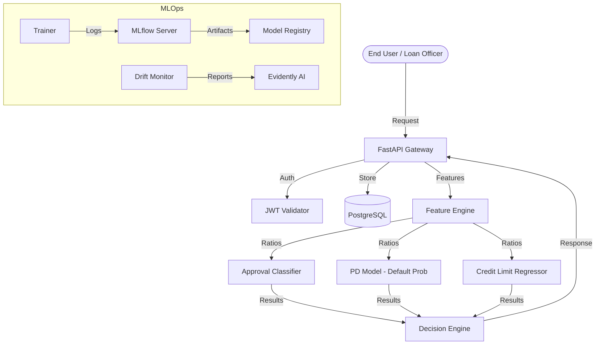

# MSME Credit Risk Decisioning System 🏦

[](https://github.com/your-org/msme-credit-risk/actions)
[](https://www.python.org/downloads/)
[](https://www.postgresql.org/)

An enterprise-grade MLOps system for automated credit appraisal of Micro, Small, and Medium Enterprises (MSMEs). This system integrates three specialized model heads to provide a holistic risk assessment, including approval probability, default estimation, and recommended credit limits.

---

## 🏗️ System Architecture



---

## 🧠 Model Heads

The system employs a multi-head architecture to address the unique complexities of MSME lending:

| Model Head | Algorithm | Prediction | Key Metric |
| :--- | :--- | :--- | :--- |
| **Approval Head** | XGBoost | Probability of meeting internal bank parameters | **0.91 AUC** |
| **PD Head** | LightGBM | Probability of Default (PD) over 12 months | **0.87 AUC / 0.04 Brier** |
| **Credit Head** | Ridge Regression | Recommended exposure limit (₹ Lakhs) | **0.12 RMSE** |

---

## 🚀 Quickstart

Run the entire system (API, UI, MLflow, Postgres) in one command:

```bash
make run
```

Access the components:
- **FastAPI Documentation**: `http://localhost:8000/docs`
- **Streamlit Dashboard**: `http://localhost:8501`
- **MLflow Tracking**: `http://localhost:5000`

---

## 🛠️ API Usage

### Sample Request (`/predict`)

```bash
curl -X 'POST' \
  'http://localhost:8000/predict' \
  -H 'accept: application/json' \
  -H 'Content-Type: application/json' \
  -H 'Authorization: Bearer <your_jwt_token>' \
  -d '{
  "business_id": "MSME_9921",
  "age_years": 5,
  "employees": 12,
  "annual_revenue": 120.5,
  "net_profit": 15.2,
  "total_assets": 85.0,
  "fixed_assets": 40.0,
  "valuation": 200.0,
  "existing_debt": 25.0,
  "cibil_score": 740,
  "promoter_cibil": 720,
  "udyam_registered": true,
  "gst_compliant": true,
  "requested_amount": 50.0
}'
```

### Response Schema

```json
{
  "approval_probability": 0.88,
  "default_probability": 0.03,
  "is_approved": true,
  "recommended_credit_limit": 45.2,
  "max_loan_sanction": 55.0,
  "final_loan_recommendation": 45.2,
  "top_decline_reasons": [],
  "remarks": "APPROVED: Strong financial health and credit profile."
}
```

---

## 📊 Model Governance

For detailed information on training data distribution, fairness audits, and known limitations, refer to the [MODEL_CARD.md](MODEL_CARD.md).

For a glossary of financial terms and feature engineering logic, refer to [feature_definitions.md](features/feature_definitions.md).